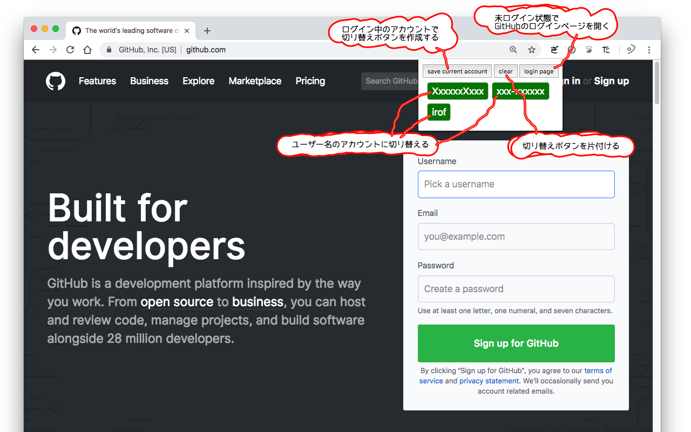

github-account-switcher
========================================

GitHubアカウントを切り替えるためのChrome拡張です。
cookieの上書きで実現しています。

## インストール

[Chromeウェブストア](https://chrome.google.com/webstore/detail/github-account-switcher/ocehdenedkdlneadcchbgffliihnoddi)から入手できます。

## 使い方

AユーザーとBユーザーを併用したい場合。

1. Aユーザーでログインする。
2. 拡張機能ポップアップの `save current account` ボタンを押す。
    - Aボタンができる。
3. 拡張機能ポップアップの `login page` ボタンを押す。
    - GitHubのログインページに遷移する。
    - *ログアウトしないこと*
4. Bユーザーでログインする。
5. 拡張機能ポップアップの `save current account` ボタンを押す。
    - Bボタンができる。
6. Aボタンを押す。
    - Aユーザーでログインした状態になる。
7. Bボタンを押す。
    - Bユーザーでログインした状態になる。

## 操作説明

- `save current account` ボタン
    - ログイン中のユーザー名のボタンが作成されます。
    - 同じユーザー名のボタンがある場合は上書きされます。
- `login page`ボタン
    - GitHubのログインページに遷移します。
    - ログアウトせずに別のアカウントでログインするためのボタンです。
    - ログイン状態で素直にログインページを開いてもログインフォームがでないのでつけました。
- `clear`ボタン
    - `save current account`で作成したボタンが全部消えます。
    - 個別に消す機能をつけるのは面倒だったので一括削除だけです。
- ユーザー名ボタン
    - `save current account`で作成されるボタンです。
    - そのユーザー名でログインした状態でページが更新されます。

## FAQ

- ユーザー名のボタンを押してもログイン状態にならない。
    - 原因: GitHubでsign outの操作をしたため、セッションが無効になっている可能性があります。
    - 対応: `login page` ボタンから再度ログインしてください。
- 拡張機能のアイコンをクリックしてもコンテキストメニューしかでてこない。
    - この拡張は https://github.com/ でしか有効になりません。

## License

[Apache License 2.0](LICENSE)

